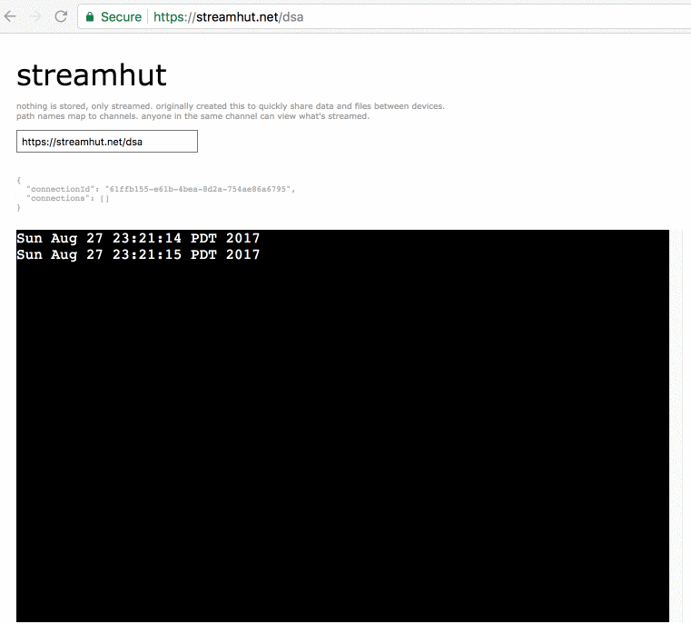

<h3 align="center">
  <br />
  
  <br />
  <br />
  <br />
</h3>

# streamhut

> Stream and send data, terminal to web and vice versa.

[](https://raw.githubusercontent.com/miguelmota/streamhut/master/LICENSE) [](https://travis-ci.org/miguelmota/streamhut) [](https://david-dm.org/miguelmota/streamhut) [](http://badge.fury.io/js/streamhut)

## Synopsis

- Stream your terminal to anyone without installing anything.
- Originally created this to quickly share data and files between devices.
- Path names map to channels.
- Anyone in the same channel can view what's streamed.
- Easily self-host your own streamhut server.

**Disclaimer: This software is alpha quality and not production ready. Use at your own risk.**

## Demo

**[https://streamhut.io](https://streamhut.io)**

## Install

```bash
$ npm install -g streamhut
```

### CLI

```bash
$ streamhut --help
                           (   )
                          (    )
                           (    )
                          (    )
                            )  )
                           (  (                  /\
                            (_)                 /  \  /\
                    ________[_]________      /\/    \/  \
           /\      /\        ______    \    /   /\/\  /\/\
          /  \    //_\       \    /\    \  /\/\/    \/    \
   /\    / /\/\  //___\       \__/  \    \/
  /  \  /\/    \//_____\       \ |[]|     \
 /\/\/\/       //_______\       \|__|      \
/      \      /XXXXXXXXXX\                  \
        \    /_I_II  I__I_\__________________\
               I_I|  I__I_____[]_|_[]_____I
               I_II  I__I_____[]_|_[]_____I
               I II__I  I     XXXXXXX     I
            ~~~~~"   "~~~~~~~~~~~~~~~~~~~~~~~~
                                    _
        _                          | |            _
  ___ _| |_  ____ _____ _____ ____ | |__  _   _ _| |_
 /___|_   _)/ ___) ___ (____ |    \|  _ \| | | (_   _)
|___ | | |_| |   | ____/ ___ | | | | | | | |_| | | |_
(___/   \__)_|   |_____)_____|_|_|_|_| |_|____/   \__)


  Usage: streamhut <cmd> [options]

  Commands:

    post [options]      post to a channel
    listen [options]    listen on a channel
    server [options]    start a streamhut server

  Options:

    -h, --help             output usage information
    -V, --version          output the version number
    -h, --host <host>      host name
    -p, --port <port>      host port
    -n, --not-secure       not using SSL
    -c, --channel <id>     channel ID
    -t, --text <text>      text to send

```

## Usage

**Listening on a channel:**

```bash
$ streamhut listen -h streamhut.io -c yo
connected to wss://streamhut.io/yo

received Fri Jun 30 2017 14:40:14 GMT-0700 (PDT):

hello

```

**Posting text data to a channel:**

```bash
$ streamhut post -h streamhut.io -c yo -t "hello"
posting data to wss://streamhut.io/yo:

hello
```

**Posting file data to a channel:**

```bash
$ streamhut post -h streamhut.io -c yo -f hello.txt
posting data to wss://streamhut.io/yo:

hello.txt
```

**Posting text data from stdin to a channel:**

```bash
$ cat hello.txt | streamhut post -h streamhut.io -c yo
posting data to wss://streamhut.io/yo:

hello
```

**Pipe realtime stdout to streamhut xterm using [`netcat`](https://en.wikipedia.org/wiki/Netcat):**

```bash
$ while true; do date; sleep 1; done | nc streamhut.io 1337
Streaming to: https://streamhut.io/dsa
```

Don't have netcat installed? No problem! Pipe to a file descriptor with an open TCP connection:

```bash
$ exec 3<>/dev/tcp/streamhut.io/1337 && head -1 <&3 && exec &> >(tee >(cat >&3))
Streaming to: https://streamhut.io/qev
```



Add a delay before piping contents to know the streamhut url ahead of time:

```bash
$ (echo -n; sleep 5; cat hello.txt) | nc streamhut.io 1337
Streaming to: https://streamhut.io/aoj
# waits 5 seconds, and then send contents of file.
```

You can even stream the whole shell session in realtime:

```bash
$ exec > >(nc streamhut.io 1337) 2>&1
```

Example of streaming tail of file:

```bash
# terminal 1
$ cat >data.txt

# terminal 2
$ tail -F data.txt | nc streamhut.io 1337
```

Example of piping to both stdout and netcat:

```bash
$ (echo -n; sleep 5; htop) | tee >(nc streamhut.io 1337)
```

### Starting a local server

**Starting a streamhut server on localhost:**

```bash
$ streamhut server -p 1336
HTTP/WebSocket port: 1336
           TCP port: 1337
```

Then specify local hostname and port to connect:

```bash
$ streamhut listen -h 127.0.0.1 -p 1336 -n -c yo
connected to ws://127.0.0.1:1336/yo
```

Post a message to the channel:

```bash
$ echo 'hello' | streamhut post -h 127.0.0.1 -n -p 1336 -c yo
posting data to ws://streamhut.io/yo:

hello
```

## Docker

You can run streamhut as a docker container:

```bash
docker pull miguelmota/streamhut
docker run -e PORT=8080 -e NET_PORT=1337 -p 8080:8080 -p 1337:1337 -e HOST_URL='https://example.com' --restart unless-stopped miguelmota/streamhut:latest
```

## Development

Start server

```bash
$ make server

HTTP/WebSocket port: 3001
           TCP port: 1337
```

Start web

```bash
$ make web
```

## Test

```bash
npm test
```

## FAQ

- Q: How is the stream log data stored?

  - A: Currently it's stored in a local sqlite3 database. More robust and scalable options are in the works.

- Q: Are there plans to rewrite streamhut in other languages?

  - A: Yes! A Golang implementation is in the works.

- Q: Can the same channel be used more than once?

  - A: Yes! send `#{channel}` (ie `#mychannel`) as the first stream text to use that channel.

    Example:

    ```bash
    exec > >(nc streamhut.io 1337) 2>&1;echo \#mychannel
    ```

## License

[MIT](LICENSE)
